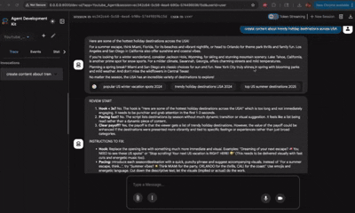
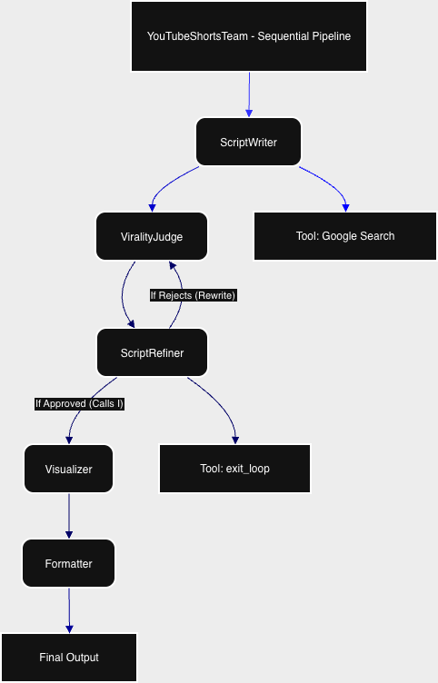

# YouTube Shorts AI Agent (Google ADK + Gemini + Docker)

This project is a **multi-agent YouTube Shorts concept generator** built with the **Google Agent Developer Kit (ADK)** and **Gemini**.

Designed as an autonomous creative partner, this agent takes a high-level topic and transforms it into a production-ready video plan. It utilizes a **sequential chain of agents** with a **self-correction loop** to ensure high quality.

### 🔄 The Workflow
Given a topic, the system:
1. **Writes a Script:** Creates a high-retention script (optimized for ≤ 60s).
2. **Critiques & Refines (Loop):** A "Judge" agent reviews the script for virality. If it lacks hooks or retention, a "Refiner" improves it (up to 3 times).
3. **Visualizes:** Generates AI image prompts and scene descriptions for every line.
4. **Formats:** Compiles everything into a structured Markdown table ready for production.

---

## ✨ Features

- 🧠 **Agentic Architecture (Google ADK)**
  - `ScriptWriter` – Drafts the initial script using Google Search for research.
  - `ViralityJudge` – Critiques content for engagement and retention.
  - `ScriptRefiner` – Iterates on the script based on feedback.
  - `Visualizer` – detailed visual direction for every beat.
  - `Formatter` – Final Markdown output.
- 🔄 **Self-Correction Loop:** Uses a `LoopAgent` to automatically improve script quality before finalizing.
- 🧩 **Sequential Orchestration:** Agents pass context seamlessly from one stage to the next.
- 🐳 **Dockerized:** Zero-setup deployment using a production-ready Docker container.
- ⚡ **Optimized Model:** Runs on **Gemini 2.5 Flash-Lite** for high speed and low cost.

---

## 🏗 Tech Stack

- **Language:** Python 3.11
- **Framework:** [Google ADK (Agent Developer Kit)](https://github.com/google/google-adk)
- **AI Model:** Gemini `gemini-2.5-flash-lite`
- **Dependency Management:** [uv](https://github.com/astral-sh/uv)
- **Containerization:** Docker

---

## 🚀 Run with Docker

You can run the agent instantly using the pre-built image. You only need a valid **Google API Key**.

```bash
docker run --rm -it \
  -p 8000:8000 \
  -e GOOGLE_API_KEY="YOUR_GOOGLE_API_KEY" \
  nikhilviky/youtube-agent:latest

## ✨ Features

- 🧠 **Agentic architecture** using Google ADK
  - `ShortScriptWriter` – script generation
  - `ShortVisualizer` – visual ideas per line
  - `ConceptFormatter` – final Markdown output
- 🧩 **Sequential orchestration** via a `SequentialAgent`
- 🔍 Optional **Google Search tool** for scriptwriter agent
- 🐳 **Dockerized** for consistent local / remote runs
- 🔑 Uses `GOOGLE_API_KEY` (no Vertex/ADC dependency)

---

## 🏗 Tech Stack

- Python 3.11
- [uv](https://github.com/astral-sh/uv) for dependency management
- Google ADK (Agent Developer Kit)
- Gemini `gemini-2.5-flash-lite` via `google-adk`
- Docker

## 🚀 Run with Docker

Make sure you have a **valid Google API key** (Gemini API).

```bash
docker run --rm -p 8000:8000 \
  -e GOOGLE_API_KEY="YOUR_GOOGLE_API_KEY" \
  nikhilviky/youtube-agent:latest
```

Open in browser:

👉 http://localhost:8000

## 🎥 Demo



## 🎥 Architecture



## 📁 Project Structure

```text
.
.
├── pyproject.toml               # Project dependencies (uv)
├── uv.lock                      # Lock file
├── README.md                    # Documentation
├── Youtube_short_agent.png      # Architecture diagram
├── tests/                       # Test suite
│   ├── integration/
│   ├── load_test/
│   └── unit/
└── Youtube_Agent/               # MAIN APPLICATION CODE
    ├── __init__.py
    ├── agent.py                 # Defines SequentialAgent, LoopAgent & Sub-agents
    ├── main.py                  # ADK app entrypoint
    ├── utils.py                 # Helper to load instructions
    ├── Dockerfile               # Container definition
    └── prompts/                 # System Instructions (Text Files)
        ├── formatter.txt
        ├── judge.txt
        ├── refiner.txt
        ├── scriptwriter.txt
        └── visualizer.txt