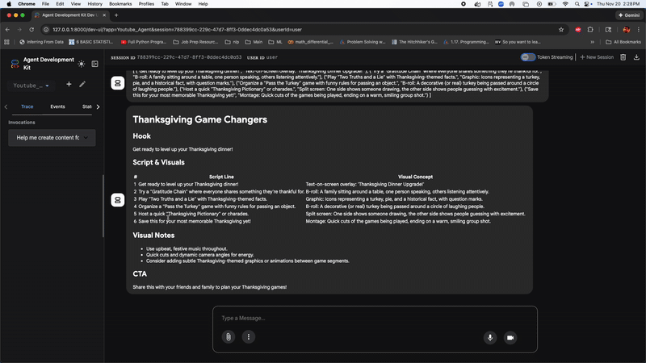

# YouTube Shorts AI Agent (Google ADK + Gemini + Docker)

This project is an **AI-powered YouTube Shorts concept generator** built with the **Google Agent Developer Kit (ADK)** and **Gemini**.

Given a high-level idea, the system:

1. **Writes a short-form script** (optimized for ≤ 60s content)
2. **Generates visual concepts** for each line/beat
3. **Formats a final Markdown-ready concept** (script + visuals table + CTA)

It’s designed to be **agentic, modular, and containerized**, so it can run locally via `uv` or in Docker.

---

## ✨ Features

- 🧠 **Agentic architecture** using Google ADK
  - `ShortScriptWriter` – script generation
  - `ShortVisualizer` – visual ideas per line
  - `ConceptFormatter` – final Markdown output
- 🧩 **Sequential orchestration** via a `SequentialAgent`
- 🔍 Optional **Google Search tool** for scriptwriter agent
- 🐳 **Dockerized** for consistent local / remote runs
- 🔑 Uses `GOOGLE_API_KEY` (no Vertex/ADC dependency)

---

## 🏗 Tech Stack

- Python 3.11
- [uv](https://github.com/astral-sh/uv) for dependency management
- Google ADK (Agent Developer Kit)
- Gemini `gemini-2.5-flash-lite` via `google-adk`
- Docker

## 🚀 Run with Docker

Make sure you have a **valid Google API key** (Gemini API).

```bash
docker run --rm -p 8000:8000 \
  -e GOOGLE_API_KEY="YOUR_GOOGLE_API_KEY" \
  nikhilviky/youtube-agent:latest
---

Open in browser:

👉 http://localhost:8000

## 📁 Project Structure

```text
.
├── pyproject.toml
├── uv.lock
├── README.md
├── Youtube_short_agent.png          # Screenshot for README (optional)
├── tests/
│   ├── integration/
│   │   └── test_agent.py
│   ├── load_test/
│   │   ├── load_test.py
│   │   └── README.md
│   └── unit/
│       └── test_dummy.py
└── Youtube_Agent/
    ├── __init__.py
    ├── agent.py                     # Defines sub-agents + SequentialAgent + root_agent
    ├── main.py                      # ADK app entrypoint (if needed)
    ├── utils.py                     # load_instruction_from_file helper
    ├── Dockerfile
    ├── formatter_instruction.txt
    ├── scriptwriter_instruction.txt
    ├── shorts_agent_instruction.txt
    └── visualizer_instruction.txt


## 🎥 Demo



    
