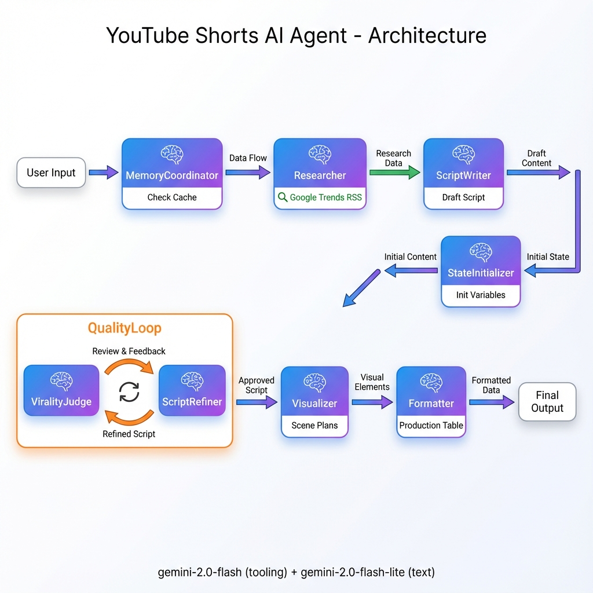

# YouTube Shorts AI Agent (Google ADK + Gemini + Google Trends)

This project is a **multi-agent YouTube Shorts concept generator** built with the **Google Agent Developer Kit (ADK)** and **Gemini 2.0**.

Designed as an autonomous creative partner, this agent takes a high-level topic request and transforms it into a production-ready video plan. It utilizes a **sequential chain of agents** with **Google Trends integration** and a **self-correction loop** to ensure viral, high-quality content.

---

## 🔄 The Workflow

Given a topic request, the system:

1. **Checks Memory (Optional):** MemoryCoordinator checks for cached research (placeholder feature).
2. **Research Trending Topics:** Researcher calls Google Trends RSS API to find viral, timely topics.
3. **Writes a Script:** ScriptWriter creates a high-retention script (optimized for ≤ 60s).
4. **Initializes State:** StateInitializer sets up session variables for the quality loop.
5. **Critiques & Refines (Loop):** A "ViralityJudge" agent reviews the script for virality. If score < 8/10, a "ScriptRefiner" improves it (up to 3 iterations).
6. **Visualizes:** Generates AI image prompts and scene descriptions for every line.
7. **Formats:** Compiles everything into a structured Markdown table ready for production.

---

## ✨ Features

- 🧠 **Advanced Agentic Architecture (Google ADK)**
  - `MemoryCoordinator` – Future-ready memory placeholder
  - `Researcher` – Fetches real-time trending topics from Google Trends RSS
  - `ScriptWriter` – Drafts the initial script based on trending data
  - `StateInitializer` – Prevents context variable errors in quality loop
  - `ViralityJudge` – Critiques content for engagement (scores 0-10)
  - `ScriptRefiner` – Iterates on the script based on feedback (calls `exit_loop` when quality threshold met)
  - `Visualizer` – Detailed visual direction for every beat
  - `Formatter` – Final Markdown table output
  
- 🌐 **Google Trends Integration via MCP**
  - Custom **MCP (Model Context Protocol)** server for Google Trends
  - Real-time trending search data from Google Trends RSS feed
  - Async tool implementation (`trends_tool`) for seamless ADK integration
  - Three query types: trending searches, interest over time, related queries

- 🔌 **What is MCP?**
  - **MCP (Model Context Protocol)** is a standard for connecting AI models to external data sources
  - Allows agents to call custom tools/APIs in a standardized way
  - Our implementation: `mcp_server.py` exposes Google Trends data via MCP
  - `mcp_client_tool.py` wraps the MCP server as an ADK `FunctionTool`
  - Enables the Researcher agent to fetch real-time trending topics

- 🔄 **Smart Quality Loop**
  - Uses `LoopAgent` with tool-based exit (`exit_loop`)
  - Maximum 3 iterations with score threshold of 8/10
  - Automatic refinement until viral potential is achieved

- 🧩 **Sequential Orchestration**
  - Agents pass context seamlessly via session state
  - Clean separation of concerns
  - No tool compatibility conflicts

- ⚡ **Optimized Models**
  - `gemini-2.0-flash` for agents with tools (Researcher, StateInitializer, Refiner)
  - `gemini-2.0-flash-lite` for text-only agents (Visualizer, Formatter)

- 🐳 **Dockerized**
  - Zero-setup deployment using production-ready Docker container
  - Environment variable configuration

---

## 🏗 Tech Stack

- **Language:** Python 3.13
- **Framework:** [Google ADK (Agent Developer Kit)](https://github.com/google/google-adk)
- **AI Models:** 
  - `gemini-2.0-flash` (for tool-enabled agents)
  - `gemini-2.0-flash-lite` (for text generation)
- **Tools & Integration:**
  - **Google Trends MCP Server** - Custom Model Context Protocol implementation
    - `pytrends` library for RSS feed parsing
    - Async server running alongside ADK
    - Exposes: `get_trending_searches`, `get_interest_over_time`, `get_related_queries`
  - **MCP Client Tool** - ADK `FunctionTool` wrapper
    - Async communication with MCP server
    - Type-safe tool interface for agents
- **Dependency Management:** [uv](https://github.com/astral-sh/uv)
- **Containerization:** Docker

---

## 🚀 Quick Start

### Option 1: Run with Docker

You can run the agent instantly using the pre-built image. You only need a valid **Google API Key**.

```bash
docker run --rm -it \
  -p 8000:8000 \
  -e GOOGLE_API_KEY="YOUR_GOOGLE_API_KEY" \
  nikhilviky/youtube-agent:latest
```

Open in browser: **http://localhost:8000**

### Option 2: Run Locally with uv

```bash
# Clone the repository
git clone <your-repo-url>
cd youtube-shorts-agent

# Install dependencies
uv sync

# Set your API key
export GOOGLE_API_KEY="your_key_here"

# Run the agent
uv run adk web .
```

Open in browser: **http://127.0.0.1:8000**

---

## 🎥 Architecture



### Agent Pipeline:

```
User Request
    ↓
MemoryCoordinator (Check cache)
    ↓
Researcher (Google Trends RSS → Content Brief)
    ↓
ScriptWriter (Draft Script)
    ↓
StateInitializer (Init session variables)
    ↓
QualityLoop [ViralityJudge ↔ ScriptRefiner] (Max 3 iterations, exit at score ≥ 8)
    ↓
Visualizer (Scene descriptions + AI image prompts)
    ↓
Formatter (Production-ready Markdown table)
    ↓
Final Output
```

---

## 📁 Project Structure

```text
.
├── pyproject.toml                    # Project dependencies (uv)
├── uv.lock                           # Lock file
├── README.md                         # This file
├── architecture_updated.png          # Architecture diagram
├── tests/                            # Test suite
│   ├── test_trends.py               # Google Trends MCP tests
│   └── ...
└── Youtube_Agent/                    # MAIN APPLICATION CODE
    ├── __init__.py
    ├── agent.py                      # Defines all agents & pipeline
    ├── main.py                       # ADK app entrypoint
    ├── utils.py                      # Helper to load prompts
    ├── Dockerfile                    # Container definition
    ├── mcp_server.py                # Google Trends MCP server
    ├── tools/
    │   └── mcp_client_tool.py       # MCP client wrapper (trends_tool)
    └── prompts/                      # System Instructions (Text Files)
        ├── memory_coordinator.txt   # Memory check prompt
        ├── researcher.txt           # Trends research prompt
        ├── scriptwriter.txt         # Script writing prompt
        ├── judge.txt                # Quality evaluation prompt
        ├── refiner.txt              # Script refinement prompt
        ├── visualizer.txt           # Visual planning prompt
        └── formatter.txt            # Output formatting prompt
```

---

## 🧪 Testing

Run the test suite:

```bash
# Run all tests
uv run pytest

# Test Google Trends integration specifically
uv run pytest tests/test_trends.py -v
```

---

## 🔑 Environment Variables

| Variable | Required | Description |
|----------|----------|-------------|
| `GOOGLE_API_KEY` | Yes | Your Gemini API key from Google AI Studio |

Get your API key at: https://aistudio.google.com/app/apikey

---

## 🛠 Development

### Adding New Agents

1. Create prompt file in `Youtube_Agent/prompts/`
2. Define agent in `Youtube_Agent/agent.py`
3. Add to `root_agent.sub_agents` list

### Tool Compatibility Rules

- **Agents with custom `FunctionTool`** → Use `gemini-2.0-flash`
- **Text-only agents** → Use `gemini-2.0-flash-lite`
- **Cannot mix** Google grounding tools (`google_search`) with custom tools in same agent

---

## 📝 License

MIT License - see [LICENSE](./LICENSE) file for details.

---

## 🙏 Acknowledgments

Built with:
- [Google Agent Developer Kit (ADK)](https://github.com/google/google-adk)
- [Google Gemini](https://deepmind.google/technologies/gemini/)
- [pytrends](https://github.com/GeneralMills/pytrends)